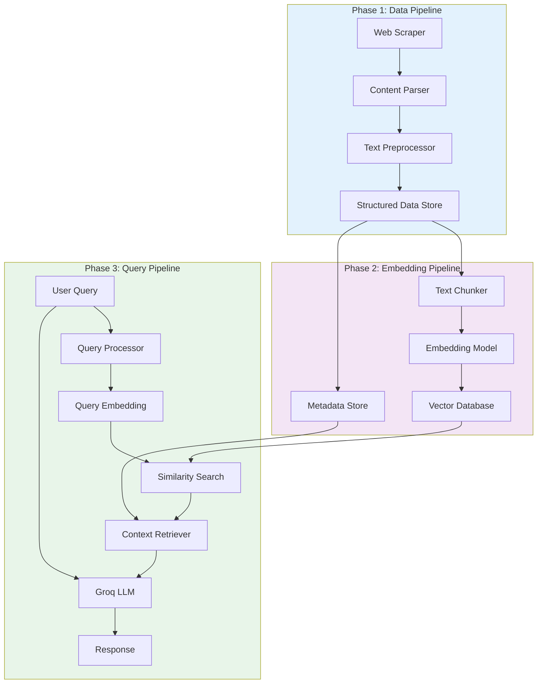

# Nextleap RAG Chatbot Architecture

A production-ready RAG (Retrieval-Augmented Generation) chatbot for the [Nextleap Product Management Fellowship](https://nextleap.app/course/product-management-course) to intelligently answer student queries about the 16-week curriculum, instructors, tools, schedule, and program details.

---

## 🎯 System Overview

### Purpose
Build an intelligent chatbot that provides accurate, contextual answers about the Nextleap Product Management Fellowship by:
- Scraping and processing course content from the official webpage
- Generating semantic embeddings for efficient retrieval
- Using RAG architecture with GroqLLM for contextual responses
- Supporting queries about curriculum, instructors, tools, and logistics

### Key Features
- **Smart Retrieval**: Vector-based semantic search for relevant course content
- **Contextual Responses**: LLM-powered answers grounded in actual course data
- **Multi-Category Support**: Handles queries about curriculum, instructors, tools, schedule, and general program info
- **Source Attribution**: Cites specific weeks, instructors, and course sections
- **Scalable Design**: Modular architecture for easy updates and enhancements

---

## 🏗️ System Architecture



---

## 🔧 Technology Stack

| Component | Technology | Purpose |
|-----------|-----------|---------|
| **Web Scraping** | BeautifulSoup4, Requests | Extract course content |
| **Data Processing** | Pandas, JSON | Structure and transform data |
| **Embeddings** | sentence-transformers | Generate semantic vectors |
| **Vector DB** | ChromaDB | Store and search embeddings |
| **Metadata DB** | SQLite | Store chunk metadata |
| **LLM** | Groq (Mixtral/Llama3) | Generate contextual responses |
| **NLP** | NLTK/spaCy | Text preprocessing |
| **Testing** | pytest | Quality assurance |

---

## 📋 Phase-Wise Development

---

## Phase 1: Data Collection & Preprocessing

### Goal
Extract, parse, and clean all relevant course content from the Nextleap website to create a structured knowledge base.

### Components

#### 1.1 Web Scraper
**Location**: `src/scrapers/`

**Files**:
- `course_scraper.py` - Main scraper for course content
- `utils.py` - Helper functions (rate limiting, error handling)

**Responsibilities**:
- Scrape https://nextleap.app/course/product-management-course
- Extract curriculum (16 weeks), instructors, tools, schedule, testimonials
- Handle rate limiting and retries
- Save raw HTML and JSON output

**Output**:
```
data/raw/
├── course_page.html          # Raw HTML
└── scraped_content.json      # Initial JSON extraction
```

---

#### 1.2 Content Parser
**Location**: `src/parsers/`

**Files**:
- `curriculum_parser.py` - Parse 16-week curriculum
- `instructor_parser.py` - Parse instructor profiles
- `tools_parser.py` - Parse tools/technologies
- `general_parser.py` - Parse schedule, logistics, testimonials

**Responsibilities**:
- Parse HTML sections into structured data
- Extract metadata (week numbers, instructor names, tool categories)
- Organize content by category

**Data Schema**:
```json
{
  "curriculum": {
    "weeks": [
      {
        "week_number": 1,
        "title": "Mapping Business Outcomes to Product Outcomes",
        "topics": ["Systems Thinking", "KPI Trees", "First Principles"],
        "hands_on": "Case on Swiggy Customer Support...",
        "content": "Full week description..."
      }
    ]
  },
  "instructors": [
    {
      "name": "Arindam Mukherjee",
      "title": "Co-founder of NextLeap",
      "background": "Head of consumer product at Flipkart...",
      "teaches": "First 3 weeks"
    }
  ],
  "tools": [
    {"category": "User Research", "tools": ["Microsoft Clarity", "Hotjar"]}
  ],
  "schedule": {
    "saturday_morning": "10:30 AM - 12:30 PM IST",
    "saturday_afternoon": "2:00 PM - 4:00 PM IST"
  }
}
```

---

#### 1.3 Text Preprocessor
**Location**: `src/preprocessing/`

**Files**:
- `text_cleaner.py` - Clean and normalize text
- `metadata_extractor.py` - Extract structured metadata

**Responsibilities**:
- Remove HTML artifacts and special characters
- Normalize whitespace and Unicode
- Preserve structure (bullets, headers)
- Extract entities (week numbers, names, tools)

**Processing Pipeline**:
```
Raw Text → Remove HTML → Normalize Unicode → Fix Whitespace → 
Extract Metadata → Validate → Clean Text + Metadata
```

---

#### 1.4 Data Storage
**Location**: `data/`

**Structure**:
```
data/
├── raw/                      # Raw scraped data
│   ├── course_page.html
│   └── scraped_content.json
├── processed/                # Cleaned structured data
│   ├── curriculum.json
│   ├── instructors.json
│   ├── tools.json
│   ├── schedule.json
│   └── general_info.json
└── metadata/
    └── scrape_log.json       # Scraping metadata and timestamps
```

---

### Phase 1 Deliverables
- ✅ Complete scraped dataset from Nextleap course page
- ✅ Structured JSON files for all content categories
- ✅ Cleaned and preprocessed text ready for chunking
- ✅ Unit tests for parsers and cleaners

### Phase 1 Verification
1. Verify all 16 weeks of curriculum captured
2. Validate JSON schema integrity
3. Manual spot-check for accuracy
4. Run unit tests with mock HTML data

---

## Phase 2: Embedding Generation & Storage

### Goal
Transform processed text into semantic embeddings and store them in a vector database for efficient retrieval.

---

#### 2.1 Text Chunker
**Location**: `src/chunking/`

**Files**:
- `chunker.py` - Main chunking logic
- `strategies.py` - Different chunking strategies (semantic, fixed-size, etc.)

**Responsibilities**:
- Split content into optimal chunks for embedding
- Apply semantic chunking (by week, topic, instructor)
- Add chunk overlap for context preservation
- Tag chunks with metadata

**Chunking Strategy**:
```python
{
  "chunk_id": "curr_week1_001",
  "content": "Week 1: Mapping Business Outcomes to Product Outcomes...",
  "metadata": {
    "source": "curriculum",
    "category": "curriculum",
    "week": 1,
    "topics": ["Systems Thinking", "KPI Trees"],
    "chunk_type": "weekly_overview"
  },
  "token_count": 450
}
```

**Chunk Size Guidelines**:
- Curriculum: 400-600 tokens/chunk
- Instructor bios: 200-300 tokens
- Tools: 150-250 tokens
- Schedule/logistics: 100-200 tokens
- Overlap: 50-100 tokens between chunks

---

#### 2.2 Embedding Generator
**Location**: `src/embeddings/`

**Files**:
- `embedding_generator.py` - Generate embeddings
- `models.py` - Model loading and configuration

**Embedding Model**:
- **Primary**: `all-MiniLM-L6-v2` (384 dimensions, fast, efficient)
- **Alternative**: `all-mpnet-base-v2` (768 dimensions, higher quality)

**Responsibilities**:
- Load sentence-transformer model
- Generate embeddings for all chunks
- Batch processing for efficiency
- Normalize vectors for cosine similarity

**Code Example**:
```python
from sentence_transformers import SentenceTransformer

class EmbeddingGenerator:
    def __init__(self, model_name="all-MiniLM-L6-v2"):
        self.model = SentenceTransformer(model_name)
    
    def generate_embeddings(self, texts: list) -> np.ndarray:
        return self.model.encode(texts, normalize_embeddings=True)
```

---

#### 2.3 Vector Database
**Location**: `src/vector_db/`

**Files**:
- `chroma_client.py` - ChromaDB implementation
- `base_client.py` - Abstract base for vector DB interface

**ChromaDB Configuration**:
- Collection name: `nextleap_course_v1`
- Embedding dimension: 384 (or 768)
- Distance metric: Cosine similarity
- Persistence: Local disk storage

**Responsibilities**:
- Create and manage collections
- Store embeddings with metadata
- Execute similarity searches
- Filter by metadata (week, category, etc.)

**Key Operations**:
```python
class ChromaVectorStore:
    def create_collection(name: str) -> Collection
    def add_embeddings(chunks: list, embeddings: list) -> None
    def search(query_embedding: np.ndarray, top_k: int, filters: dict) -> list
    def get_by_metadata(filters: dict) -> list
```

---

#### 2.4 Metadata Store
**Location**: `src/metadata_store/`

**Files**:
- `sqlite_store.py` - SQLite metadata database

**Database Schema**:
```sql
CREATE TABLE chunks (
    chunk_id TEXT PRIMARY KEY,
    content TEXT NOT NULL,
    source TEXT,
    category TEXT,
    week INTEGER,
    metadata JSON,
    created_at TIMESTAMP DEFAULT CURRENT_TIMESTAMP
);

CREATE TABLE instructors (
    id INTEGER PRIMARY KEY,
    name TEXT,
    title TEXT,
    background TEXT,
    teaches TEXT
);

CREATE TABLE tools (
    id INTEGER PRIMARY KEY,
    name TEXT,
    category TEXT,
    description TEXT
);

CREATE INDEX idx_category ON chunks(category);
CREATE INDEX idx_week ON chunks(week);
```

**Purpose**:
- Store full chunk content and metadata
- Enable metadata-based filtering
- Support quick lookups by category, week, etc.

---

### Phase 2 Data Flow

```
Processed Data → Text Chunker → Chunks with Metadata
                                       ↓
                           Embedding Generator
                                       ↓
                 ChromaDB (vectors) + SQLite (metadata)
```

---

### Phase 2 Deliverables
- ✅ All course content chunked and stored
- ✅ Embeddings generated for all chunks
- ✅ ChromaDB collection populated
- ✅ SQLite metadata database created
- ✅ Test queries verify retrieval quality

### Phase 2 Verification
1. Verify chunk sizes and overlap
2. Test similarity search with sample queries
3. Validate metadata integrity
4. Measure retrieval quality (precision@k, recall@k)

---

## Phase 3: Query Processing & Response Generation

### Goal
Build the query interface that processes user questions, retrieves relevant context, and generates accurate responses using GroqLLM.

---

#### 3.1 Query Processor
**Location**: `src/query/`

**Files**:
- `query_processor.py` - Main query processing
- `query_classifier.py` - Classify query intent
- `query_expander.py` - Query expansion techniques

**Query Processing Pipeline**:
```python
User Query → Normalize → Classify → Expand → Generate Embedding → Processed Query
```

**Query Types**:
- `curriculum` - Course content, weeks, topics
- `instructors` - Teaching staff, backgrounds
- `tools` - Technologies, software taught
- `schedule` - Class times, structure
- `general` - Program logistics, fees, testimonials

**Example**:
```python
class QueryProcessor:
    def process(self, query: str) -> dict:
        return {
            "original_query": query,
            "normalized": self.normalize(query),
            "query_type": self.classify(query),
            "expanded_query": self.expand(query),
            "embedding": self.generate_embedding(query)
        }
```

---

#### 3.2 Context Retriever
**Location**: `src/retrieval/`

**Files**:
- `retriever.py` - Main retrieval logic
- `reranker.py` - Rerank retrieved results (optional)
- `context_builder.py` - Build LLM context from chunks

**Retrieval Strategy**:
1. Generate query embedding
2. Search vector DB (top-k=5-10)
3. Filter by query type metadata
4. Optional: Rerank with cross-encoder
5. Fetch full content from metadata store
6. Build formatted context for LLM

**Context Format**:
```
Context Information:
---
[Week 1: Mapping Business Outcomes]
You will go through an intensive 16 week learning journey covering...
Topics: Systems Thinking, KPI Trees, First Principles
(Source: Curriculum, Week 1)

[Instructor: Arindam Mukherjee]
Arindam Mukherjee is the Co-founder of NextLeap and teaches the first 3 weeks...
(Source: Instructors)
---
```

**Configuration**:
- Top-k results: 5-10
- Similarity threshold: 0.7
- Max context tokens: 2500-3000

---

#### 3.3 LLM Integration
**Location**: `src/llm/`

**Files**:
- `groq_client.py` - Groq API integration
- `prompt_templates.py` - Prompt templates
- `response_formatter.py` - Format and validate responses

**GroqLLM Configuration**:
```python
{
    "model": "mixtral-8x7b-32768",  # or "llama3-70b-8192"
    "temperature": 0.3,              # Low for factual accuracy
    "max_tokens": 1024,
    "top_p": 0.9
}
```

**Prompt Template**:
```python
SYSTEM_PROMPT = """
You are a helpful assistant for the NextLeap Product Management Fellowship.
Answer student questions using ONLY the provided context.

Guidelines:
- Be accurate and cite specific weeks, instructors, or tools when relevant
- If the context doesn't contain the answer, say so clearly
- Be concise but comprehensive
- Use a friendly, supportive tone
"""

USER_PROMPT = """
Context:
{context}

Student Question: {query}

Answer:
"""
```

**Response Formatting**:
- Clean markdown artifacts
- Add source citations
- Format lists and bullets
- Validate response relevance

---

#### 3.4 Chatbot Orchestrator
**Location**: `src/api/`

**Files**:
- `chatbot.py` - Main chatbot class
- `chat_history.py` - Conversation history tracking
- `response_cache.py` - Cache frequent queries

**Main Chatbot Class**:
```python
class NextleapChatbot:
    def __init__(self):
        self.query_processor = QueryProcessor()
        self.retriever = ContextRetriever()
        self.llm_client = GroqClient()
        self.cache = ResponseCache()
    
    def answer_query(self, user_query: str) -> dict:
        # Check cache
        if cached := self.cache.get(user_query):
            return cached
        
        # Process query
        processed = self.query_processor.process(user_query)
        
        # Retrieve context
        context = self.retriever.retrieve_context(processed)
        
        # Generate response
        response = self.llm_client.generate_response(
            query=user_query,
            context=context
        )
        
        # Cache and return
        result = {
            "query": user_query,
            "response": response,
            "sources": context["sources"],
            "confidence": self._calculate_confidence(context)
        }
        self.cache.set(user_query, result)
        return result
```

---

### Phase 3 Data Flow

```
User Query → Query Processor → Query Embedding
                                      ↓
                          Vector DB Similarity Search
                                      ↓
                            Context Retriever
                                      ↓
                  Groq LLM (Context + Query) → Response
```

---

### Phase 3 Deliverables
- ✅ Complete query processing pipeline
- ✅ Context retrieval with metadata filtering
- ✅ GroqLLM integration with custom prompts
- ✅ Working chatbot demo
- ✅ Response caching for efficiency

### Phase 3 Verification
1. **Unit Tests**: Test individual components
2. **Integration Tests**: End-to-end query flow
3. **Manual Testing**: 20-30 diverse test queries
4. **Quality Metrics**: Accuracy, relevance, response time

**Sample Test Queries**:
```python
[
    "What topics are covered in week 1?",
    "Who are the instructors for this course?",
    "What tools will I learn in the AI modules?",
    "When are the Saturday classes scheduled?",
    "Tell me about the RAG module in week 8",
    "How long is the Product Management Fellowship?",
    "What SQL practice is included in the curriculum?"
]
```

---

## 📁 Complete Project Structure

```
nextleap-chatbot/
├── data/
│   ├── raw/                      # Phase 1: Raw scraped data
│   ├── processed/                # Phase 1: Structured JSON
│   └── metadata/                 # Scraping logs
├── database/
│   ├── chroma_db/                # Phase 2: ChromaDB storage
│   └── metadata.db               # Phase 2: SQLite metadata
├── src/
│   ├── scrapers/                 # Phase 1: Web scraping
│   │   ├── course_scraper.py
│   │   └── utils.py
│   ├── parsers/                  # Phase 1: Content parsing
│   │   ├── curriculum_parser.py
│   │   ├── instructor_parser.py
│   │   ├── tools_parser.py
│   │   └── general_parser.py
│   ├── preprocessing/            # Phase 1: Text cleaning
│   │   ├── text_cleaner.py
│   │   └── metadata_extractor.py
│   ├── chunking/                 # Phase 2: Text chunking
│   │   ├── chunker.py
│   │   └── strategies.py
│   ├── embeddings/               # Phase 2: Embeddings
│   │   ├── embedding_generator.py
│   │   └── models.py
│   ├── vector_db/                # Phase 2: Vector DB
│   │   ├── chroma_client.py
│   │   └── base_client.py
│   ├── metadata_store/           # Phase 2: Metadata DB
│   │   └── sqlite_store.py
│   ├── query/                    # Phase 3: Query processing
│   │   ├── query_processor.py
│   │   ├── query_classifier.py
│   │   └── query_expander.py
│   ├── retrieval/                # Phase 3: Context retrieval
│   │   ├── retriever.py
│   │   ├── reranker.py
│   │   └── context_builder.py
│   ├── llm/                      # Phase 3: LLM integration
│   │   ├── groq_client.py
│   │   ├── prompt_templates.py
│   │   └── response_formatter.py
│   └── api/                      # Phase 3: Main API
│       ├── chatbot.py
│       ├── chat_history.py
│       └── response_cache.py
├── tests/
│   ├── test_scrapers/
│   ├── test_parsers/
│   ├── test_preprocessing/
│   ├── test_chunking/
│   ├── test_embeddings/
│   ├── test_retrieval/
│   ├── test_llm/
│   └── test_integration/
├── scripts/
│   ├── run_phase1.py             # Execute Phase 1
│   ├── run_phase2.py             # Execute Phase 2
│   ├── run_phase3_demo.py        # Demo chatbot
│   └── evaluate_chatbot.py       # Evaluation metrics
├── config/
│   ├── config.yaml               # Main configuration
│   └── prompts.yaml              # Prompt templates
├── .env.example                  # Environment variables
├── .gitignore
├── requirements.txt
├── README.md
└── setup.py
```

---

## ⚙️ Configuration

### Environment Variables (`.env`)
```bash
# Groq API
GROQ_API_KEY=your_groq_api_key_here

# Vector Database
CHROMA_PERSIST_DIR=./database/chroma_db

# Metadata Database
METADATA_DB_PATH=./database/metadata.db

# Embedding Model
EMBEDDING_MODEL=all-MiniLM-L6-v2

# LLM Settings
LLM_MODEL=mixtral-8x7b-32768
LLM_TEMPERATURE=0.3
LLM_MAX_TOKENS=1024

# Retrieval Settings
TOP_K_RESULTS=5
CONTEXT_MAX_TOKENS=3000
```

### Configuration File (`config/config.yaml`)
```yaml
scraping:
  course_url: "https://nextleap.app/course/product-management-course"
  rate_limit_seconds: 2
  timeout_seconds: 30

chunking:
  curriculum_chunk_size: 500
  instructor_chunk_size: 300
  overlap_tokens: 100

embeddings:
  model_name: "all-MiniLM-L6-v2"
  batch_size: 32
  normalize: true

retrieval:
  top_k: 5
  similarity_threshold: 0.7
  rerank: false

llm:
  model: "mixtral-8x7b-32768"
  temperature: 0.3
  max_tokens: 1024
```

---

## 📦 Dependencies

```txt
# requirements.txt

# Web Scraping
beautifulsoup4==4.12.3
requests==2.31.0
lxml==5.1.0

# Data Processing
pandas==2.2.0
numpy==1.26.3

# NLP & Embeddings
sentence-transformers==2.3.1
nltk==3.8.1

# Vector Database
chromadb==0.4.22

# LLM Integration
groq==0.4.1

# Utilities
python-dotenv==1.0.0
pydantic==2.5.3
pyyaml==6.0.1

# Testing
pytest==7.4.4
pytest-cov==4.1.0
```

---

## 🚀 Execution Guide

### Phase 1: Data Collection
```bash
# Run scraping and preprocessing
python scripts/run_phase1.py

# Expected output:
# data/raw/course_page.html
# data/processed/curriculum.json
# data/processed/instructors.json
# data/processed/tools.json
# data/processed/schedule.json
```

### Phase 2: Embedding Generation
```bash
# Generate embeddings and populate vector DB
python scripts/run_phase2.py

# Expected output:
# database/chroma_db/ (vector database)
# database/metadata.db (SQLite database)
```

### Phase 3: Demo Chatbot
```bash
# Run interactive chatbot demo
python scripts/run_phase3_demo.py

# Expected interaction:
# You: What topics are covered in week 1?
# Bot: Week 1 covers Mapping Business Outcomes to Product Outcomes...
```

---

## 🧪 Testing Strategy

### Unit Tests
- **Phase 1**: Parser functions with mock HTML
- **Phase 2**: Chunking logic, embedding generation
- **Phase 3**: Query processing, retrieval, LLM integration (mocked)

### Integration Tests
- End-to-end query → response flow
- Database CRUD operations
- Real Groq API calls (limited test set)

### Evaluation Metrics
- **Retrieval Quality**: Precision@5, Recall@5, MRR
- **Response Quality**: Human evaluation (accuracy, relevance)
- **Performance**: Query latency, LLM response time

---

## 🔄 Maintenance & Updates

### Updating Course Content
1. Re-run Phase 1 scraper
2. Re-run Phase 2 embedding generation
3. Vector DB automatically updated

### Improving Response Quality
- Adjust prompt templates in `config/prompts.yaml`
- Tune retrieval parameters (top-k, threshold)
- Experiment with different LLM models/temperatures

### Adding New Features
- Multi-turn conversations: Extend `chat_history.py`
- Query suggestions: Build query template library
- Analytics: Track popular queries and response ratings

---

## 📊 Performance Optimization

### Caching
- **Query embeddings**: Cache frequent queries
- **Responses**: Cache identical query responses
- **Vector retrieval**: In-memory cache for hot chunks

### Batch Processing
- Batch embed chunks in Phase 2
- Batch retrieve when possible

### Async Operations
- Async scraping with `aiohttp`
- Async LLM calls with Groq async client

---

## 📝 Development Workflow

### Phase 1 → Phase 2 → Phase 3
Each phase builds on the previous:

1. **Phase 1** creates the knowledge base
2. **Phase 2** makes it searchable
3. **Phase 3** makes it conversational

Start Phase 2 only after Phase 1 verification passes.
Start Phase 3 only after Phase 2 retrieval tests pass.

### Code Quality
- Type hints for all functions
- Docstrings for all classes and methods
- Unit tests for all modules
- Integration tests for pipelines

---

## 🎯 Success Criteria

### Phase 1
- ✅ 100% curriculum coverage (all 16 weeks)
- ✅ All instructors, tools, schedule captured
- ✅ Clean, structured JSON output

### Phase 2
- ✅ All content chunked and embedded
- ✅ Vector DB retrieval accuracy > 80%
- ✅ Metadata filtering works correctly

### Phase 3
- ✅ Query response time < 3 seconds
- ✅ Response accuracy > 85% (human eval)
- ✅ Proper source attribution in all responses
- ✅ Graceful handling of out-of-scope queries

---

## 📚 Additional Resources

- **Groq API Docs**: https://console.groq.com/docs
- **ChromaDB Docs**: https://docs.trychroma.com/
- **Sentence Transformers**: https://www.sbert.net/
- **RAG Best Practices**: Research papers on retrieval-augmented generation

---

**Architecture Version**: 1.0  
**Last Updated**: February 2026  
**Target Course**: [Nextleap Product Management Fellowship](https://nextleap.app/course/product-management-course)
